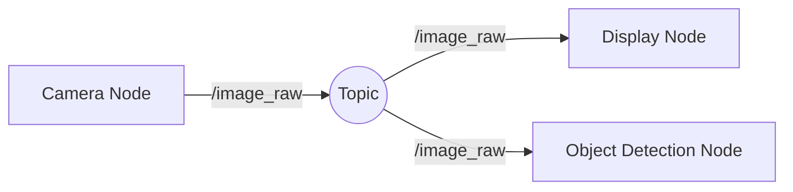

# 1.2 Nodes, Topics & Services

## 1.2.1 ROS 2 Nodes

A **Node** is a fundamental processing unit in ROS 2. It is typically designed to perform one specific task, such as reading a laser scanner or controlling a motor. A complex robot system is composed of many nodes working together.

### Example: A Camera Node

Imagine a robot with a camera. A specific "Camera Node" would be responsible for communicating with the camera driver and publishing images.

## 1.2.2 Topics (Publisher / Subscriber)

Nodes communicate via **Topics**. This is a many-to-many, asynchronous communication model.

- **Publisher:** A node that sends data (e.g., Camera Node sends an image).
- **Subscriber:** A node that receives data (e.g., Object Detection Node receives the image).



## 1.2.3 Services (Client / Server)

**Services** are used for synchronous, request-response communication. Use services when a node needs a specific answer or action to complete before proceeding.

- **Example:** A "Spawn Object" service in a simulator. You send a request (where to spawn), and you wait for a confirmation (success/failure).

## 1.2.4 Hands-on: Launching Turtlesim

Let's visualize this using the classic `turtlesim` package.

1.  **Start the simulator:**
    ```bash
    ros2 run turtlesim turtlesim_node
    ```
2.  **Control the turtle:**
    ```bash
    ros2 run turtlesim turtle_teleop_key
    ```

You now have two nodes running: the simulator (Subscriber) and the keyboard controller (Publisher).
