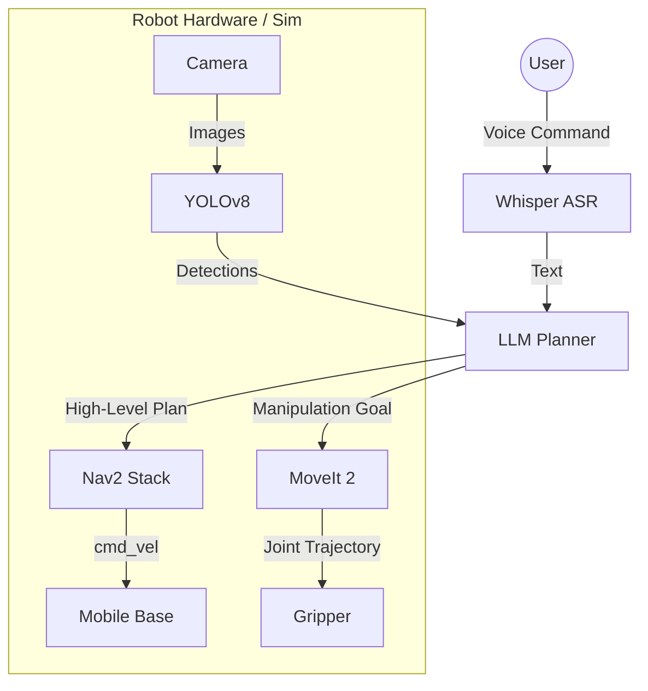

# 4.4 Capstone Project: The Autonomous Humanoid

Congratulations Cadet. You have learned about ROS 2, Digital Twins, NVIDIA Isaac, and VLA Models. It is time to build the ultimate project.

## 4.4.1 The Mission

You will simulate a Unitree G1 Humanoid in NVIDIA Isaac Sim that can:
1.  **Patrol** a warehouse environment (Nav2).
2.  **Detect** intruders or anomalies (Isaac ROS / YOLO).
3.  **Respond** to voice commands (Whisper).
4.  **Explain** its actions (LLM Integration).

## 4.4.2 Architecture

## 4.4.3 Submission

To complete this course, submit a video recording of your simulation performing a "Search and Retrieve" mission from a voice command.
